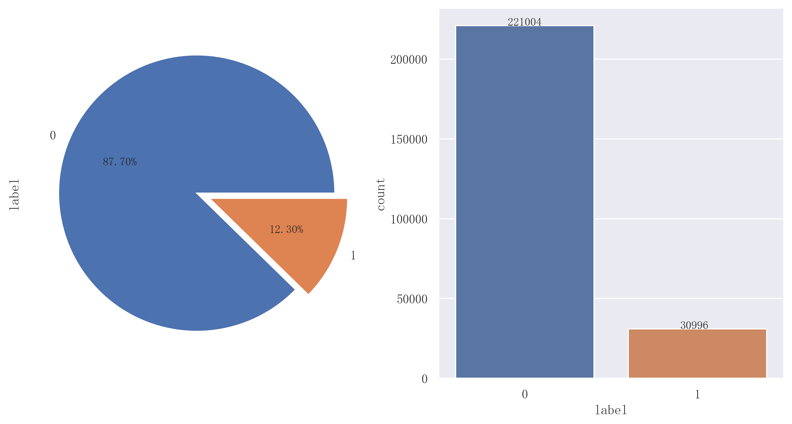

# 用户贷款违约预测

## 评估指标AUC
* 版本1：0.92235835
* 版本2：待测试

## 数据解释
| 字段 | 描述 | 类型 |
| :------: | :------: | :------: |
| id | 样本唯一标识符 | 字符串 |
| income | 用户收入 | 整数 |
| age | 用户年龄 | 整数 |
| experience_years | 用户从业年限 | 整数 |
| is_married | 用户是否结婚 | 字符串 |
| city | 居住城市，匿名处理 | 整数 |
| region | 居住地区，匿名处理 | 整数 |
| current_job_years | 现任职位工作年限 | 字符串 |
| current_house_years | 在现房屋的居住年数 | 整数 |
| house_ownership | 房屋类型：租用；个人；未有 | 整数 |
| car_ownership | 是否拥有汽车 | 字符串 |
| profession | 职业，匿名处理 | 整数 |
| label | 表示过去是否存在违约 | float |

## 数据探索

1. 标签分布

