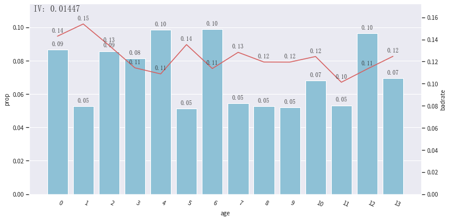

# 用户贷款违约预测

## 评估指标AUC
* 版本1：0.92235835
* 版本2：待测试

## 数据概括

### 字段解释

| 字段 | 描述 | 类型 |
| :------: | :------: | :------: |
| id | 样本唯一标识符 | 字符串 |
| income | 用户收入 | 整数 |
| age | 用户年龄 | 整数 |
| experience_years | 用户从业年限 | 整数 |
| is_married | 用户是否结婚 | 字符串 |
| city | 居住城市，匿名处理 | 整数 |
| region | 居住地区，匿名处理 | 整数 |
| current_job_years | 现任职位工作年限 | 字符串 |
| current_house_years | 在现房屋的居住年数 | 整数 |
| house_ownership | 房屋类型：租用；个人；未有 | 整数 |
| car_ownership | 是否拥有汽车 | 字符串 |
| profession | 职业，匿名处理 | 整数 |
| label | 表示过去是否存在违约 | float |

### 数据集概括

　　数据总计252000条，其中，训练集168000条，测试集84000条。

## 数据探索

### 标签分布
　　正负样本比为1：6，具体分布如图所示：  

### 字段探索

* 用户收入  
　　由于`用户收入`并不呈现正态分布，为了更好的观察`用户收入`该因素对正负样本的区分能力，通过决策树方法对`用户收入`进行分箱，一共分为16个箱。  

* 用户年龄  
　　从用户年龄分布来看，不同的年龄段客户的违约占比有明显的差异。  

* 用户从业年限  
　　从用户从业年限来看，不同的从业年限违约占比有明显的差异。  

* 用户是否结婚  
　　从用户是否结婚的违约占比来看，单身用户中的违约客户占比为12.53%，而已婚用户中的违约客户占比为10.25%，显然单身客户的违约可能性更高。  

* 居住城市  
　　根据各城市正例样本占比分布情况，居住城市因素能够较好的区分正负样本。

* 居住地区  

* 现任职位工作年限  

* 在现房屋的居住年数  

* 房屋类型  

* 是否拥有汽车  

* 职业  

## 附录

### 用户收入分箱

| 箱号 | 分箱节点 | 箱号 | 分箱节点 |
| :------: | :------: | :------: | :------: |
| 0 | <589656 | 8 | [4631314,5501417.5) |
| 1 | [589656,1150872.5) | 9 | [5501417.5,6124010) |
| 2 | [1150872.5,1780438.5) | 10 | [6124010,6670759.5) |
| 3 | [1780438.5,2301651) | 11 | [6670759.5,7225756.5) |
| 4 | [2301651,2830020) | 12 | [7225756.5,7756246.5) |
| 5 | [2830020,3432781.5) | 13 | [7756246.5,8597341.5) |
| 6 | [3432781.5,4075132.5) | 14 | [8597341.5,9486604) |
| 7 | [4075132.5,4631314) | 15 | [9486604,) |

### 用户年龄

| 箱号 | 分箱节点 | 箱号 | 分箱节点 |
| :------: | :------: | :------: | :------: |
| 0 | (,25.5] | 7 | [53.5,56.5) |
| 1 | [25.5,28.5) | 8 | [56.5,59.5) |
| 2 | [28.5,33.5) | 9 | [59.5,62.5) |
| 3 | [33.5,38.5) | 10 | [62.5,66.5) |
| 4 | [38.5,44.5) | 11 | [66.5,69.5) |
| 5 | [44.5,47.5) | 12 | [69.5,75.5) |
| 6 | [47.5,53.5) | 13 | [75.5,) |

### 用户从业年限

| 箱号 | 分箱节点 | 箱号 | 分箱节点 |
| :------: | :------: | :------: | :------: |
| 0 | (,2.5] | 5 | [11.5,12.5) |
| 1 | [2.5,5.5) | 6 | [12.5,14.5) |
| 2 | [5.5,7.5) | 7 | [14.5,17.5) |
| 3 | [7.5,9.5) | 8 | [17.5,18.5) |
| 4 | [9.5,11.5) | 9 | [18.5,) |

